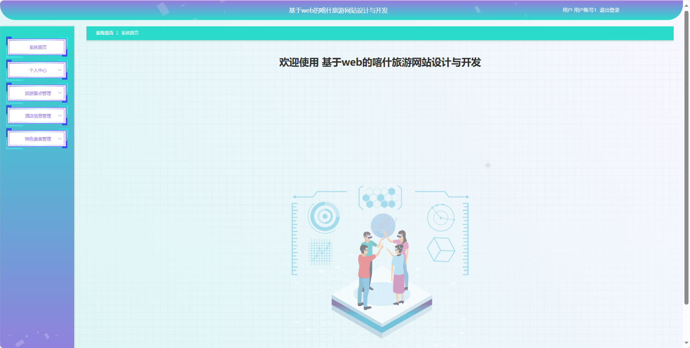
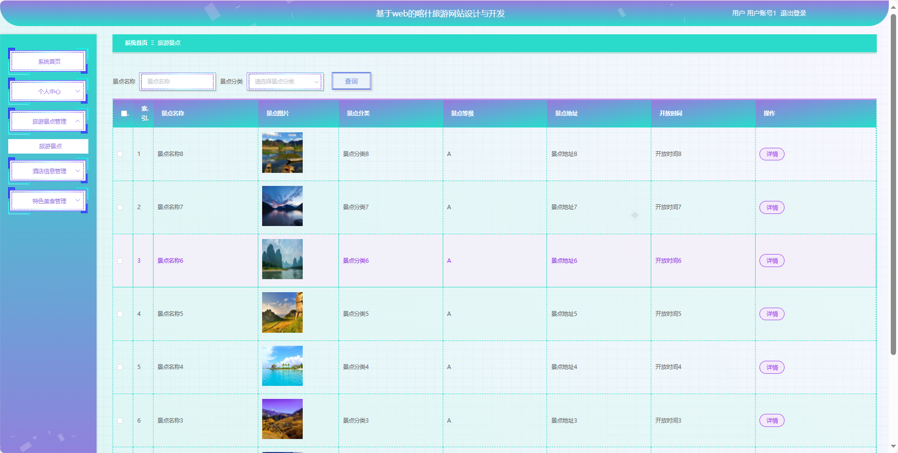
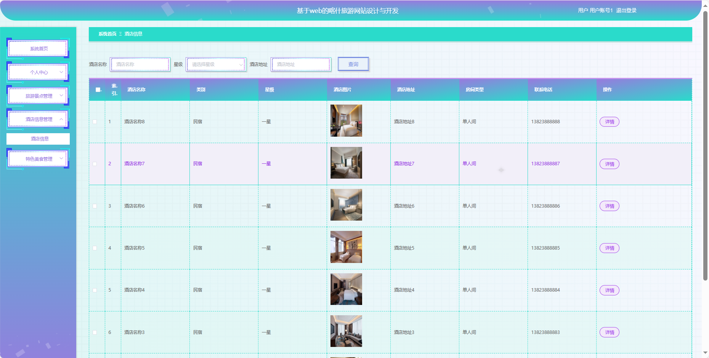
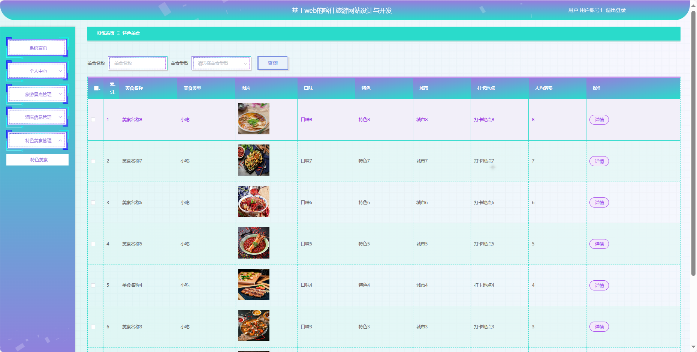
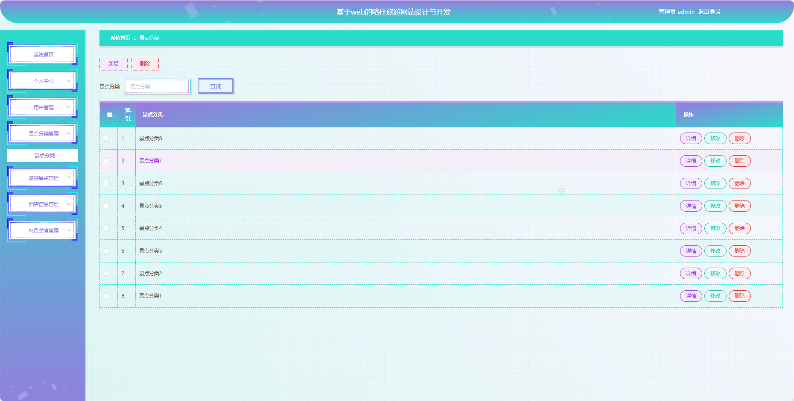
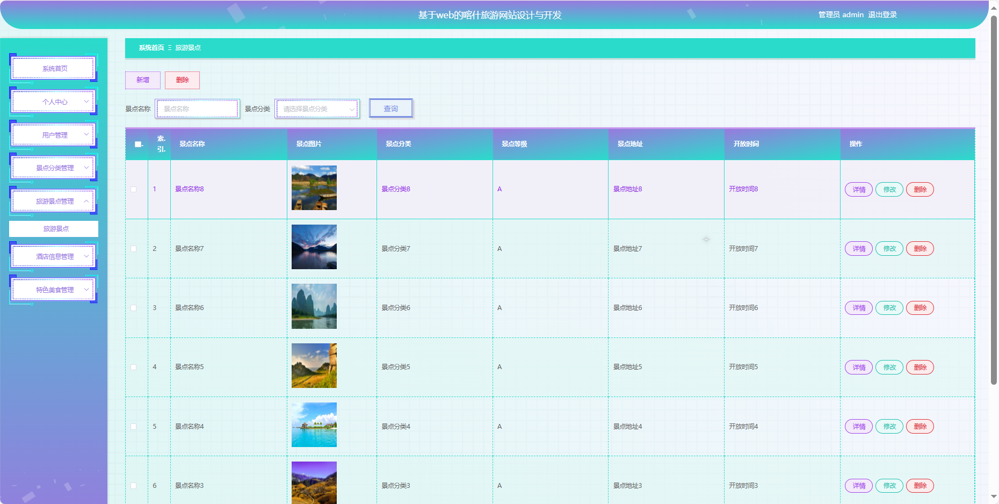
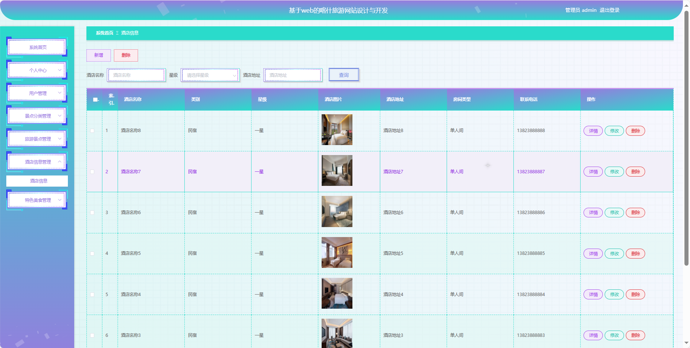
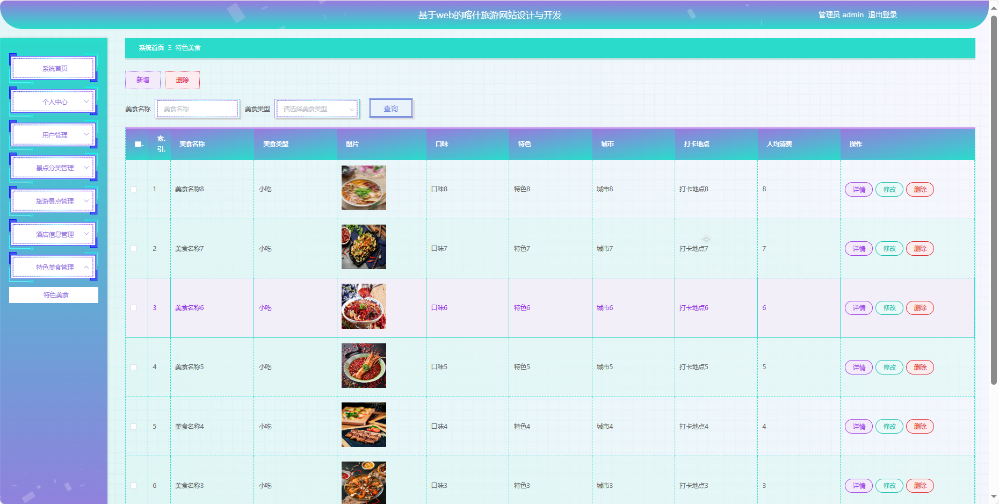
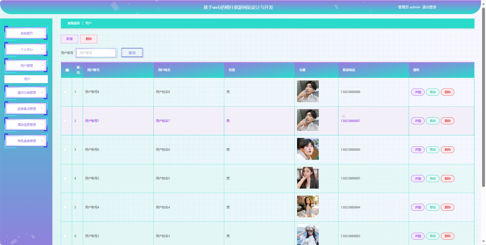

## 基于SpringBoot的喀什旅游网站

- <b>完整代码获取地址：从戎源码网 ([https://armycodes.com/](https://armycodes.com/))</b>
- <b>技术探讨、资料分享，请加QQ群：692619798</b> 
- <b>作者微信：19941326836  QQ：952045282</b> 
- <b>承接计算机毕业设计、Java毕业设计、Python毕业设计、深度学习、机器学习</b>
- <b>选题+开题报告+任务书+程序定制+安装调试+论文+答辩ppt 一条龙服务</b>
- <b>所有选题地址 ([https://github.com/YuLin-Coder/AllProjectCatalog](https://github.com/YuLin-Coder/AllProjectCatalog)) </b>

## 项目介绍
基于SpringBoot的喀什旅游网站，系统包含两种角色：管理员、用户主要功能如下。

### 【管理员】:
系统首页：查看喀什旅游网站整体概况。
个人中心：管理个人信息。
用户管理：审核和管理注册用户的信息。
景点分类管理：管理旅游景点的分类信息。
旅游景点管理：监管和管理旅游景点的详细信息。
酒店信息管理：管理酒店的基本信息，价格、房型等。
特色美食管理：管理特色美食的信息，推荐、介绍等。

### 【用户】:
系统首页：浏览喀什旅游网站信息。
个人中心：管理个人信息、查看订单记录等。
旅游景点管理：浏览、搜索和了解各个旅游景点的详细信息。
酒店信息管理：查看喀什地区的酒店信息，价格、设施等。
特色美食管理：了解和搜索当地的特色美食信息。

## 项目技术
- 编程语言：Java
- 数据库：MySQL
- 项目管理工具：Maven
- 前端技术：HTML、CSS、JavaScript、Jquery、Vue
- 后端技术：Spring、SpringMVC、MyBatis

## 运行环境
- JDK版本：JDK1.8及以上
- 开发工具：IDEA、Ecplise、Myecplise都可以
- 数据库: MySQL5.7及以上
- Maven：maven3.0及以上
- Node：14.14.0及以上

## 运行截图

